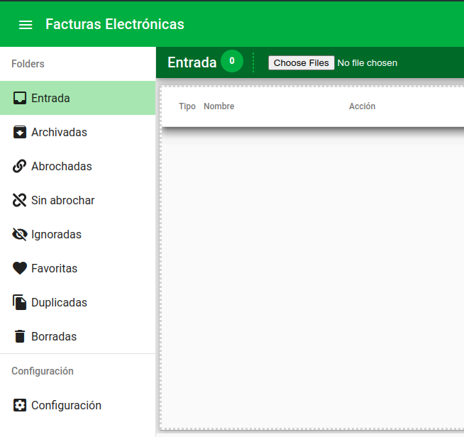

Documentación del proyecto [Factura Digital Argentina](https://dev.facturadigital.ar)

# Factura Digital Argentina
Factura Digital Argentina es una aplicación web que permite administrar facturas y recibos digitales, ingresados al sistema como pdf, o cualquier tipo de imágenes.
El proyecto aun está en desarrollo, y [dev](https://dev.facturadigital.ar) es el único ambiente disponible hasta el momento por lo que puede ser que aun contenga errores, y su uso es bajo la exclusiva responsabilidad del usuario.

El proyecto por el momento no es open source, pero si es libre para su uso "tal y como está".

Por la misma razón no se da ningún tipo de soporte o responsabilidad en caso que alguien alguien decida usarlo en algún emprendimiento comercial. No nos hacemos responsables por pérdidas o daños a los archivos.

## ¿Qué es?
La herramienta provee una interfase para administrar facturas en formato digital y nació como un proyecto personal por la necesidad de administración de las facturas para la economía familiar, pero con el tiempo fui agregándole cada vez más funcionalidades que me permitan manejar el volumen de los datos que necesitaba.
Como ejemplo en mi cuenta personal tengo actualmente cargados 1400 archivos entre comprobantes y facturas, lo que les da una idea del volumen manejado por la aplicación.

Como creo que el proyecto maduró lo suficiente con las distintas prestaciones, decidí compartirlo por si alguien más le sirve y para que me ayuden a mejorarlo.

## ¿Porqué se llama así?
Se llama Factura Digital argentina porque como dije el proyecto originalmente fue desarrollado en Argentina, y tiene su código basado en resolver problemas de las facturas argentinas (formato de números, recuperar fechas, etc), pero eso no quiere decir que en algún momento pueda ser exportadoa otro lugares si se hacen los ajustes correspondientes. No está descartado que en algún momento pueda ser portado, mejorado o incluso traducido, ya que su contenido ya se encuentra internacionalizado.

## ¿Cómo lo instalo?
No es necesario instalar ningún programa, por lo que con solo acceder a la página, te pedirá conectarse a tu cuenta de Google y así podrá configurarse y guardar allí tus facturas.
Una vez iniciada la aplicación podrás ver que en [Google Drive](https://drive.google.com) creará una carpeta llamada Invoices donde irá depositando todos las facturas o recibos creados.
Esos archivos son tuyos y siempre estarán en tu Google Drive por lo que siempre los tendrás disponibles aunque en el futuro rechaces el uso de la aplicación o deniegues el acceso a drive tus archivos siguen siendo tuyos.

## ¿Qué me permite hacer?
El proyecto permite administrar los archivos etiquetarlos, ordenarlos, asociarlos y agregarle la metadata que nos permita administrarlos, incluso tenemos la posibilidad de "abrocharlos" tal como haríamos con cualquier factura de papel. En la bandeja de entrada se pueden cargar los archivos, arrastrándolos y soltándolos desde un administrador de archivos, y simplementes haciendo clic en el botón de upload. Una ver cargados los archivos, se puede agregar la información, como fecha de vencimiento, si es una factura o un recibo, el importe o intentar que cargue esos datos automáticamente haciendo clic en el botón "Voy a tener suerte"

## ¿Donde guarda mis archivos?
El proyecto está integrado con Google Drive, y nos permite usar nuestra cuenta de Google Drive personal como repositorio de los archivos y dejarlos disponibles para adminsitrarlos o compartirlos. 
Es por ésto que el proyecto no guarda ninguna información personal, ni guarda archivos en servidores del proyecto, sino que se basa en una plataforma provista por Google y sobre ella agrega las funcionalidades de administración y guardado de información y configuración. Como dijimos anteriormente los archivos son solo tuyos, y siempre quedarán guardados en tu Google Drive. 
La información que necesita para ordenar y organizarlos queda guardada en cada un de los archivos, por lo que ninguna información será subida a ningún servidor propio de la aplicación ni compartida.

# ¿Cómo lo uso?
El objetivo siempre fue organizar los archivos que se agreguen y organizarlos para hacerlos fácil de administrar y encontrar cuando por alguna razón necesitemos llegar a ellos. Similar a gmail o a cualquier herramienta de correo podremos agregarle información que nos permita 

Para ésto cuenta con los siguientes accesos o menues:

* __Entrada:__Permite agregar los archivos cuando los recibimos y podermos agregar la información que necesitamos para archivarlos, la fecha de vencimiento, la empresa de la factura (Edenor, Movistar, Personal, Edea), si es factura o recibo de pago y el importe.
* __Archivadas:__Una vez que las facturas o comprobantes tienen sus datos cargados se pueden archivar y sacarlos de la entrada y tenerlos guardados
* __Abrochadas:__Cuando las facturas o recibos han sido abrochados o adjuntados a otro archivo (por el momento solo permite uno solo) los archivos pasan a estar abrochados.
* __Sin abrochar__Aquí podremos ver los archivos del tipo facturas a los cuales aun no se les abrochó el comprobante.
* __Ignoradas:__En algunos casos podremos subir archivos que luego nos dimos cuenta que no queríamos subirlos. Aquí veremos los que ignoramos en algún momento de la clasificación.
* __Favoritas:__Probablemente mientras estemos buscando algún comprobante o buscando algún pago en particular, podremos poner algún archivo (factura/recibo) como favorito, para tenerlo al alcance de la mano.
* __Duplicadas:__(en desarrollo) Aquí debería mostrar aquellos archivos que podrían coincidir con otro, por nombre, empresa o por fecha, y la idea es detectarlos en caso que dos archivos similares hayan sido subidos a la herramienta.
* __Borradas__:Cualquier archivo que hayamos borrado aparecerá en éste listado y nos permitirá recuperarlo en caso que lo hayamos hecho por error

## ¿Cómo colaboro?
Me gustaría mucho que me cuentes que te pareció, me des tu opinión o me propongas algo que te gustaría ver en la herramienta, eso me ayudará mejorar y con tu devolución podré mejorar la herramienta.
Como dije el objetivo del proyecto no es cobrar por él pero si te gustó y quieres reconocer mi trabajo podrías invitarme un café.

<a href="https://www.buymeacoffee.com/leonardo.flores" target="_blank">

## Próximos pasos
Me quedan aún muchas ideas para implementar, y las tengo debidamente documentadas, pero ya se los iré contando oportunamente, en la medida que tenga tiempo y recursos, ya que ésto lo hago por hobbie.
Algunas de las ideas que tengo son:
* Imprimir: Permitir imprimir desde el adminsitrador
* Bajar archivos comprimidos: Despues de una búsqueda de alguna empresa o algún tipo de archivo, permitir bajar el resultado como un zip, lo que nos permitiría por ejemplo tenér todos los recibos y facturas en formato digital según un criterio, por ejemplo "todas las facturas y recibos de Edenor de los últimos años"
* Mejorar la organización jerárquica: Actualmente en el menú de __Archivadas__ se pueden cambiar tres vistas, lista, por empresa y por fecha. Ésto nos deja navegar la información por un nivel jerárquico pero habría que trabajarlo un poco más.  

# Versión actual
La versión actual es la 0.9.1 y aun sigo trabajando en las correcciones y mejoras, así como también en las funcionalidades que me gustaría que tenga.
